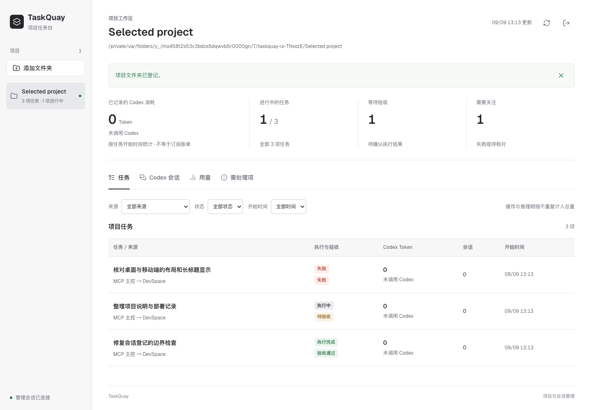

# TaskQuay

通过 ChatGPT 调用本机工具、安排 Codex 任务，并查看执行结果与用量。

[简体中文](README.md) · [English](README.en.md) · [GitHub](https://github.com/orange4664/taskquay) · [接入教程](docs/chatgpt-mcp-setup.zh-CN.md) · [MIT 许可证](LICENSE)

TaskQuay 是一个自托管的 MCP 服务和项目任务台。你在 ChatGPT 中讨论方案、下达任务；ChatGPT 可以直接读取项目，在需要时调用本机 Codex，再返回代码变更、检查结果和 Token 用量。

本仓库是 [wrfgup/taskquay](https://github.com/wrfgup/taskquay) 的维护分支，增加了 GUI 文件夹选择、已有 Codex 会话登记和相关安全修复。在 `/console/` 点击 **添加文件夹**，然后进入项目的 **Codex 会话 → 登记已有会话**，勾选要显示的会话。详见[登记操作、安全边界与升级说明](docs/local-registration.md)。

TaskQuay 基于 **[Waishnav/DevSpace](https://github.com/Waishnav/devspace)** 开发，保留上游 MIT 版权声明；本项目与 OpenAI、Anthropic 及上游 DevSpace 均无官方隶属关系。

> **目前建议从本仓库源码运行。** TaskQuay 尚未发布 npm 包，上游 npm 包不包含本分支的改动。为兼容已有安装，CLI、配置目录、MCP 标识及部分界面仍使用 `devspace`。

## 工作方式

```text
ChatGPT 网页对话 → 已授权的 TaskQuay MCP → 本地工作区 / Coding Agent
```

负责安排任务和检查结果的模型称为“主控”。它可以先通过 MCP 读取文件、搜索文本，再把明确的任务和所需上下文交给 Codex。相关任务可以继续已有会话，减少在 ChatGPT 与 Codex 之间手工转述的工作。重要约束仍应写入任务或项目规则：ChatGPT 能否使用长期记忆和个性化设置取决于当前模式与账号，这些信息也不会自动完整传给 Codex。[官方设置说明](https://help.openai.com/en/articles/11487775-connectors-in-chatgpt)

连接成功后，本机电脑、TaskQuay 服务和网络入口都须保持在线。使用这条路径无需另建 Codex Remote 会话，但电脑关机、休眠或断网后就无法接收任务。

请先在桌面网页完成接入。[官方 MCP FAQ](https://help.openai.com/en/articles/12584461-developer-mode-and-mcp-apps-in-chatgpt) 当前标注 web-only，原生手机 App 不在支持范围内。手机浏览器需实际能选择并调用自定义连接；切换“桌面版网站”未必可用。

## 主要功能

| 功能 | 用法与限制 |
| --- | --- |
| **直接读取项目** | 主控用 `read`、`workspace_context` 查看文件、搜索文本和获取版本引用，无需为背景调查先启动 Codex。 |
| **协调并行任务** | 默认最多两个活跃代理，同一源码最多两个经过权限确认的只读任务。写入独占，构建和设备按资源协调，超额任务在本地排队，等待期间不启动模型推理。 |
| **复用 Codex 会话** | 按工作项、问题域和角色匹配空闲会话，也可指定代理继续。工作目标、会话上下文与请求去重分别管理；会话繁忙时等待，无关任务和独立验收可以另开会话。 |
| **查看项目任务** | 在 `/console/` 查看任务来源、执行状态、验收结果、Codex 会话、用量和待核对的资源占用。 |
| **记录完成回执** | 用量分为完整、部分、未知和未调用，缺失数据不会记成零。 |
| **整理受管会话** | 归档或恢复前先预览，再确认。活动任务、有外部续写或无法确认归属的会话会被跳过。 |

并行限制只适用于使用同一协调机制的任务。外部编辑器和未纳管终端不受这些锁约束；不同 worktree 使用同一构建输出时，也须声明相同的资源键。

会话复用有助于减少重复探索，但不会自动扫描并接管全部私人聊天，也不保证缓存命中或固定的 Token 节省比例。实际用量以任务回执为准，完成质量由主控验收。

文件内容返回给 ChatGPT 后会离开本机，委派材料也可能发送给模型提供方。请只连接你有权使用的项目，并确认接入客户端与提供方的数据使用规则。

相关修复记录：[2026-09-08 轨迹复盘](docs/trajectory-review-20260908.md)。

## 界面预览

### 在 ChatGPT 中调用本机 Codex


### 在回复中查看 Codex Token 用量回执


### 在任务台查看任务与 Token 用量



任务台使用浅色界面、本地字体和简短的过渡动画。窄屏下任务按行展开，也可以在面板中选择文件夹、登记会话。

侧栏 **接入与使用**（`/console/#guide`）提供当前配置中的 MCP 地址、OAuth 填写步骤和只读测试指令。完成配置后，需在 ChatGPT 中检查授权和工具调用结果。项目可按名称或路径搜索；任务列表刷新后保留已加载的分页，断线时显示最近结果和重试入口。

## 从源码安装

环境以 `package.json` 为准：Node.js `>=22.19 <27`、Git、`pnpm@11.25.0`。使用 Codex 委派时，另行安装并登录兼容的 Codex CLI；Windows 建议准备 Git Bash，并用 `doctor` 检查本机工具。直接读取工作区不需要发起 Codex 推理。

```sh
git clone https://github.com/orange4664/taskquay.git
cd taskquay
npm install --global pnpm@11.25.0
pnpm install --frozen-lockfile
pnpm build
node bin/devspace.js init
node bin/devspace.js doctor
node bin/devspace.js serve
```

初始化时选择运行位置、授权项目目录、模型提供方和接入地址。首次使用时，先阅读下方的两种接入方式，再填写 `publicBaseUrl`。只授权需要使用的目录，并妥善保管 owner 口令（任务台登录和授权页面使用的口令），不要将它放进聊天、Issue 或截图。

`package.json` 中的 `private: true` 防止将此分支误发布到上游 npm 包名下，不影响源码开源。升级前先备份配置和状态。**`pnpm build` 会替换 `dist`，请在独立源码目录中构建，等待活动任务结束后再切换服务版本。**

## 创建 ChatGPT 插件 / 应用并连接 MCP

**接入信息核对日期：2026-09-06。** 这里的“插件／应用”指开发者模式下的 MCP 连接，不是自定义 GPT 中的 OpenAPI Actions。

OpenAI 当前开发者文档的入口为 **设置 → Security and login（安全与登录）→ Developer mode**，然后进入 [ChatGPT Plugins](https://chatgpt.com/plugins)，点 **+** 创建。部分账号仍显示 **设置 → Apps／应用 → Advanced settings／高级设置**，组织账号还可能需要管理员开启权限。[官方创建步骤](https://developers.openai.com/plugins/deploy/connect-chatgpt)

不同官方页面对部分套餐能力的描述并不完全一致。请以账号实际显示的入口、管理员授权和真实工具调用结果为准，不能仅凭拥有 Plus／Pro 就保证所有读写功能都可用。[开发者指南](https://developers.openai.com/api/docs/guides/developer-mode) · [帮助中心](https://help.openai.com/en/articles/12584461-developer-mode-and-mcp-apps-in-chatgpt)

| 方式 | 在 ChatGPT 填什么 | 适用条件 |
| --- | --- | --- |
| **服务器 URL** | 自己控制的 `https://域名/mcp` | 有 HTTPS 入口，TaskQuay 的 MCP 与 OAuth 路由都可达。 |
| **OpenAI 官方 Tunnel** | 选择 Tunnel，并选择或填写实际 `tunnel_id` | 有隧道权限、runtime key、在线的 `tunnel-client`，并单独打通 OAuth。 |

### 方式 A：通过服务器 URL 接入

**第一步：让 HTTPS 入口转发到正确的电脑。** TaskQuay 默认监听 `http://127.0.0.1:7676`。可以使用自己控制的反向代理或 HTTPS 隧道；转发目标必须是项目实际所在、运行 TaskQuay 的机器。云服务器上的 `127.0.0.1` 不是你家里的电脑。

转发范围不能只有 `/mcp`：本项目还需要 OAuth 发现、注册、授权和令牌路由。建议按根路径正确代理 TaskQuay 服务，同时保留 `/console/` 的默认远程访问限制。[完整路由与网络说明](docs/chatgpt-mcp-setup.zh-CN.md#server-url)

**第二步：设置站点根地址并启动服务。** 将示例替换为你自己的 HTTPS 地址，`publicBaseUrl` 不带 `/mcp`：

```sh
node bin/devspace.js config set publicBaseUrl https://taskquay.example.com
node bin/devspace.js serve
```

**第三步：在 ChatGPT 创建连接。** 名称填写 `TaskQuay`，连接方式选择 **Server URL／服务器 URL**，填写 `https://taskquay.example.com/mcp`，身份验证选择 **OAuth**。TaskQuay 使用动态客户端注册，固定 Client ID／Client Secret 留空，owner 口令只填在自己的 TaskQuay 授权页。

**第四步：完成 owner 授权并验收。** 在 TaskQuay 弹出的授权页面核对应用、范围和资源地址，再输入自己的 owner 口令。返回 ChatGPT 后检查工具列表；新对话中从工具／插件菜单选中 TaskQuay，先测试只读调用。后续需要调用工具时，再次选择或明确提及 TaskQuay。

### 方式 B：通过 OpenAI 官方 Secure MCP Tunnel 接入

这种方式由本机客户端主动连接 OpenAI，将请求转发给私有 MCP，不需要为 MCP 开放公网入站端口。它不是 Codex Remote，也不是第三方临时 HTTPS 隧道。[官方说明](https://developers.openai.com/api/docs/guides/secure-mcp-tunnels)

1. 在 [Platform → Organization → Tunnels](https://platform.openai.com/settings/organization/tunnels) 创建或选择隧道，关联实际使用的 Platform organization 与 ChatGPT workspace。创建／管理需要 **Tunnels Read + Manage**；运行或选择使用需要 **Read + Use**。ChatGPT 开发者权限是另一项权限。
2. 从 [OpenAI 官方发布页](https://github.com/openai/tunnel-client/releases/latest) 或 Tunnels 页面下载匹配系统的 `tunnel-client`，先运行 `tunnel-client help quickstart`。准备真实 `tunnel_id` 和有权限的 runtime API key，保存在本机受控环境，不写进仓库。
3. 建立 HTTP 配置，将 MCP 目标指向 `http://127.0.0.1:7676/mcp`，选用适合 OAuth/DCR 的配置，执行 `doctor` 并保持 `run` 在线。[完整命令、凭据区分和 OAuth 配置](docs/chatgpt-mcp-setup.zh-CN.md#official-tunnel)
4. 在 ChatGPT 创建应用时，Connection 选择 **Tunnel**，选择已有隧道或填入该 `tunnel_id`，继续完成授权和工具发现。此处填写隧道 ID，本机地址和运行密钥用于本机客户端配置。

**Tunnel 不会自动转发浏览器 OAuth 登录页。** TaskQuay 自带 OAuth 服务；授权页、注册和 token 交换仍须按调用方与官方隧道支持的路由打通。只启动 `tunnel-client` 不代表手机或云端就能访问电脑的 `/authorize`。没有独立打通 OAuth 时，优先使用方式 A，不要关闭鉴权。[官方 OAuth 路由说明](https://github.com/openai/tunnel-client/blob/master/docs/connectors.md)

“TaskQuay 全私网 OAuth + 官方 Tunnel”的完整流程尚未经过本项目实测。使用前，请在自己的组织与账号中完成下方验收。官方隧道用于私有／开发者模式连接，不替代公开插件商店要求的 HTTPS 服务，也不提供免费模型额度。

### 第一次调用怎么验收？

先在已启用 TaskQuay 的对话中发送：

> 使用 TaskQuay 打开我已授权的 `<项目绝对路径>`，先建立工作记录。直接读取项目说明并告诉我目录结构，不修改文件、不启动 Codex、不部署。完成后返回工作回执和 Codex 用量。

确认主控确实调用了工具、返回的路径正确，`/console/` 能看到对应任务；未调用 Codex 的这次检查应显示零。之后再明确授权一个小范围修改任务，验证变化、测试和真实 Codex 消耗。工具更新后刷新连接元数据；浏览器直接 GET `/mcp` 的响应不能替代 MCP 初始化、鉴权和工具调用测试。

本项目保留上游 MCP 2026-07-28 与旧版 2025-era 客户端的自动协议兼容，不需要手动配置“协议模式”。排错、持续运行和最小测试清单见[完整接入教程](docs/chatgpt-mcp-setup.zh-CN.md)。

## 日常任务怎么下达？

> 使用 TaskQuay 处理这个项目。先读取相关实现、确认目标与限制。主控能直接完成的调查不要重复委派；确实需要 Codex 时复用相关会话。对同一源码的写入和共享编译资源保持互斥。逐步实施、运行检查并审查最终 diff，返回结果、验收范围和本次 Codex Token 回执。部署、公开发布和破坏性操作需要另行确认。

主控用 `work_task` 建立工作记录，并在后续调用中传递 `workRunId`。子操作结束后，主控检查变更和测试结果，再结算任务。平台可能要求确认高风险工具操作，请按提示审核。

### 执行观察、断线取回与排队

`agent_task observe` 返回任务与进展 revision；主控携带上次的 `revision` 使用有界 longpoll（默认 20 秒，最大 25 秒）。累计 Token、更新时间和经过时长本身不触发提前返回。日常观察不附整份用量回执；用量查询仍走 `usage`，终态用 `includeResponse: true` 显式取回结果与完成回执。同一 revision 可反复取回，连接中断不会消费结果。

`progress` 仅包含固定阶段/工具类别、最后活动时间、时长和等待原因；构建/测试类别是 provider 事件提示，静默不等于卡死，未知数据保留未知。默认不输出命令、stdout 或模型思维。`nextAction` 指示继续观察、检查 claim 或由主控审核结果；任务完成不会自动通过验收，主控仍须显式结算 `work_task`。

队列和 busy continue 不启动额外推理、不抢写锁、不自动重放写入。收到冲突先按 `nextAction` 核对 owner/claim；相关续接在终态后使用新的 `requestKey`。工具说明中列出的 `~/…/SKILL.md` 与绝对路径可用于 `read` 和 `workspace_context capture`，仅允许已加载技能及其目录资源，并检查真实路径越界。外部技能 capture 作为阅读证据返回，不混入仅接受工作区源码的 delegation refs。

升级这些功能时，server 与 agentd 须使用一致的新版本，并在活动任务结束后切换。实测数据和版本启用记录见[执行可靠性复盘](docs/execution-reliability-trace.zh-CN.md)。

## 项目任务台与用量

任务台默认地址是 `http://127.0.0.1:7676/console/`，使用 owner 口令建立独立浏览器会话。远程访问需要单独开启，不因 MCP 接通而自动开放。[任务台说明](docs/project-console.md)

| 统计状态 | 含义 |
| --- | --- |
| **完整** | 受管执行记录和提供方用量事件齐全。 |
| **部分** | 有已记录用量，但仍存在缺口。 |
| **未知** | 数据不足，无法计算准确总量。 |
| **未调用** | 对应工作没有启动受管 Codex 推理。 |

缓存输入和推理输出已包含在对应总量中，无需再次相加。历史线程用量、手工续写和外部模型命令也不计入新任务。主控直接读取或运行本地工具、没有发起 Codex 推理时，记录为“未调用”；实际委派 Codex 会产生用量，与是否使用 MCP 或 Tunnel 无关。[统计与回调回归说明](docs/console-usage-callback-fix.md)

## 安全与当前限制

请把连接视为高权限本地访问。文件工具做工作区路径校验，但 shell 使用本机用户权限，不是通用沙箱。应用、隧道和本地 provider 的安全确认分别生效；不要为减少提示而关闭鉴权、扩大到整块磁盘或开放未知服务。

上游主要在 Windows 上开发和验证，本分支另有 macOS 登记功能的验证记录，详见上文登记说明。各功能的跨平台覆盖程度不同，请查阅对应记录。目前仍未提供自动不可变快照、任意节点 fork 或完整的自动中断恢复，也不保证缓存命中。

聊天归档不是停止后台进程。归档／恢复的安全夹具已覆盖多种边界，但此前零推理空线程实验没有完成真实恢复验证；使用前先验证明确授权的新测试会话，不要拿重要或未纳管聊天做实验。传输中断后，先核对任务和线上状态，确认上次结果再决定是否重试写入或发布。

## 开发、文档与许可

开发与手动 QA 可使用 `pnpm dev:seed` 初始化隔离状态，再运行 `pnpm dev`。
它会将正常安装的配置和 SQLite 状态复制到被 Git 忽略的 `.devspace-dev/`，
其中可能包含敏感信息，请勿分享或提交。`pnpm dev:reset` 会丢弃该 QA 状态并重新复制。
详见 [开发与手动 QA](docs/development.md)。不要在正常服务占用相同端口时启动开发服务。

```sh
pnpm typecheck
pnpm test
pnpm build
```

| 文档 | 内容 |
| --- | --- |
| [ChatGPT MCP 接入教程](docs/chatgpt-mcp-setup.zh-CN.md) | Server URL、官方 Tunnel、OAuth、首次验收与排查。 |
| [基础安装](docs/setup.md) | 本分支源码初始化与网络配置。 |
| [主控工作流](docs/chatgpt-coding-workflow.md) | 工作区、工具、审查和回执。 |
| [并发与会话](docs/host-first-readonly-workflows.md) | 直接读取文件、协调并行任务与复用会话。 |
| [配置参考](docs/configuration.md) | Provider、授权目录、并发和任务台。 |
| [安全模型](docs/security.md) | 权限和部署边界。 |
| [第三方说明](THIRD_PARTY_NOTICES.md) | 依赖许可证与品牌使用边界。 |

源码采用 [MIT](LICENSE)，保留 `Copyright (c) 2026 Waishnav` 及完整上游授权文本，来源见 [NOTICE](NOTICE)。依赖和模型服务分别适用自身条款，其中 Claude Agent SDK 使用自身许可证。

## 参考与致谢

接入教程参考了 yyjeqhc 的 [webcodex 社区介绍与接入经验](https://linux.do/t/topic/2544729)，借鉴其按部署、授权和使用分步说明的方式。本文中的命令与接口依据 TaskQuay 实现和 OpenAI 官方资料编写，不适用于 webcodex 的公共体验服务。

## 友情链接

[LINUX DO - 新的理想型社区](https://linux.do/)

友情链接与兼容性描述不代表赞助或官方背书。公开问题反馈请使用脱敏日志，不要上传真实口令、私人会话或状态数据库。
